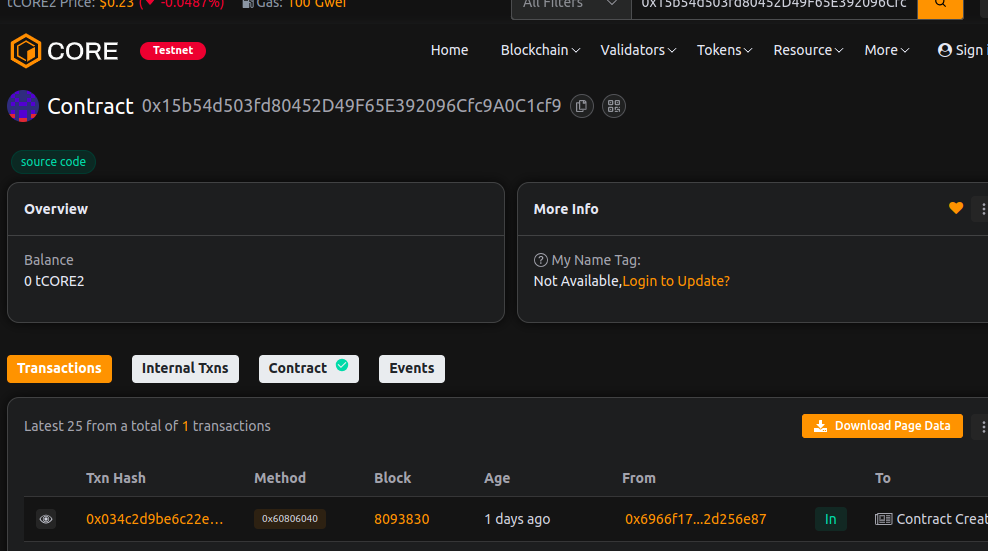

# ChainFold Protocol

### Project Description
ChainFold Protocol is a minimal, gas-conscious smart contract system for submitting and managing "folds" — batched payload roots (e.g., Merkle roots) representing aggregated state or transactions. Proposers stake ETH when submitting folds; the owner can finalize folds and distribute stakes.

### Project Vision
Provide a simple on-chain primitive that encourages honest proposals via bonded stakes, enabling rollups, aggregation layers, or batch submission workflows with an auditable, lightweight reconciliation mechanism.

### Key Features
- Submit fold roots with a required stake to discourage spam and malicious proposals.
- View fold metadata (root, proposer, timestamp, stake, finalized flag).
- Owner finalize flow to mark a fold finalized and transfer its stake to a recipient.
- Configurable stake requirement and owner rescue/withdraw capabilities.
- Minimal, gas-aware storage layout and events for off-chain indexing.

### Core contract interface (high level)
- constructor(_stakeAmount): set initial owner and required stake per fold.
- submitFold(bytes32 root) payable -> returns id: submit a new fold (requires msg.value >= stakeAmount). Emits FoldSubmitted.
- getFold(uint256 id) view -> fold details: read stored fold metadata.
- finalizeFold(uint256 id, address payable to) onlyOwner: finalize a fold, transfer its stake to `to`, emit FoldFinalized.
- setStakeAmount(uint256 newAmount) onlyOwner: update required stake for future submissions.
- withdraw(address payable to, uint256 amount) onlyOwner: owner can withdraw accidental ETH balance.
- receive() external payable: contract accepts ETH.

### Events
- FoldSubmitted(id, root, proposer, stake)
- FoldFinalized(id, to, stakeTransferred)
- StakeAmountUpdated(oldAmount, newAmount)

### Security notes
- Only owner can finalize folds or change stake amount — keep owner key secure.
- finalizeFold transfers stored stake; callers should ensure `to` is trusted.
- submitFold requires staking; proposers should manage funds accordingly.
- No built-in dispute/verification layer — integrate with off-chain verification or governance as needed.

### Future Scope
- Add dispute/challenge period for submitted folds with slashing.
- Layered rewards  or bonding curves for proposers.
- Native integration with rollup sequencers and off-chain verifiers.
- On-chain merkle proof verification utilities and indexing helpers.

### Contract address:
0x15b54d503fd80452D49F65E392096Cfc9A0C1cf9

